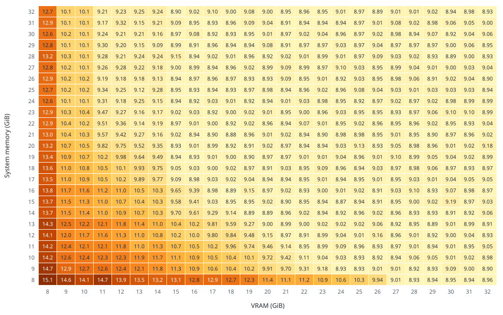
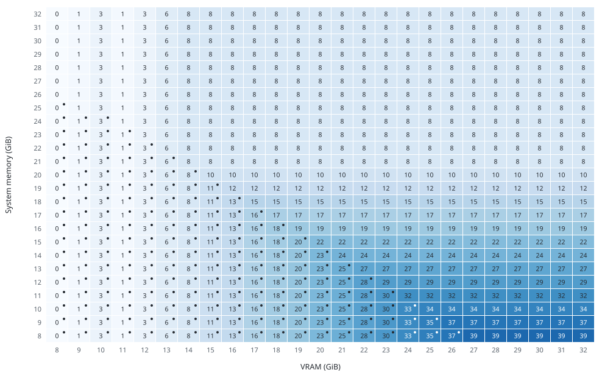

# FreeVideo Adaptive Execution Planner

The FreeVideo Adaptive Execution Planner computes an execution plan for every request from live device and host measurements. The plan fixes the residency of the 50 transformer blocks across VRAM, pinned host memory and disk, the transfer schedule, the FP8 GEMM path, the attention backend and head grouping, activation staging and the VAE decoder placement, within the measured VRAM and host-memory budgets.

## Inputs

| Input | Source | Determines |
| --- | --- | --- |
| Architecture and compute capability | CUDA device properties | FP8 GEMM path and kernel set |
| Free VRAM | `torch.cuda.mem_get_info` | VRAM budget |
| Available host memory | OS memory counters, cgroup v1/v2 limit, Windows commit headroom | Host-memory budget |
| Attention backends | On-device kernel probes | Backend selection |
| Request geometry | Width, height and frames, converted to video tokens | Activation working set |

VRAM budget: free VRAM minus a reserve of 2.5% of free VRAM, clamped to 0.5–1 GiB (0.25 GiB on Windows). Host-memory budget: available memory minus a reserve of 5% of available memory, clamped to 1–4 GiB (2–4 GiB on Windows); the Windows page file is not counted.

## Plan

| Component | Decision |
| --- | --- |
| Transformer residency | Resident blocks = min(⌊(VRAM budget − activation working set) / 432.5 MB⌋, 44), then reduced to max(8, blocks the host budget cannot retain). Non-resident blocks are kept in host memory, pinned up to 22 GB, and copied to the GPU at every step. |
| Disk streaming | Enabled when the non-resident blocks plus host working memory exceed the host budget. A bounded pinned subset is retained; the remaining blocks are re-read from disk at every step. |
| Transfer schedule | Two transfer slots (prefetch) at a VRAM budget of 14 GiB or more, with lower thresholds on Windows Blackwell and Ampere; one slot otherwise. |
| Attention | The first backend that passes its probe, in the order SageAttention 2, PyTorch flash attention, cuDNN, FlashAttention 2, FlashAttention 4. Head group: the widest of 16, 8 and 4 heads whose measured activation footprint at the request's token count fits the VRAM budget. |
| Activation staging | Below a 10 GiB VRAM budget, the residual stream and attention outputs are staged in host buffers when the on-device activation path does not fit. |
| FP8 GEMM | Per-tensor scales on Blackwell (SM120), per-channel scales on Ada (SM89) and Hopper (SM90), FP8 weights with BF16 compute on Ampere (SM80, SM86). |
| Chunking | Feed-forward chunk 2048, projection chunk 1024, window batch 4 (1 on Ampere). |
| Text encoder | Runs in a separate process that exits before the transformer is loaded. |
| VAE decoder | Below a 20 GiB VRAM budget, ⌊(VRAM budget − 3.25 GiB) / 268.6 MB⌋ of its 36 blocks stay resident and the rest are streamed; temporal clips are decoded in sequence with the original tiles and blending. |
| Two-pass sampling | The half-resolution first pass gets its own plan. Blocks copied to the GPU during that pass stay cached in free VRAM, up to the first-pass resident count on Linux and up to the live VRAM budget on Windows. |

## Runtime adaptation

- Budgets are re-measured before every request.
- Completed requests store their timings and memory peaks in `resource-history.sqlite3`. The history drives the forecast shown before each request and `./freevideo predict`, and replaces the placement when an alternative is predicted to be at least 2% faster.
- If the minimum working set does not fit, the request is rejected before the transformer loads, and the shortfall is reported.
- An out-of-memory failure is retried in a fresh process, up to two times (`--resource-retries`). The retry first lightens the placement. When nothing is left to move, it shrinks the compute partitions: head group, feed-forward and projection chunks, then attention outputs staged in host memory. This can change the floating-point reduction order. A failure in the second pass of two-pass sampling reuses the completed first pass, and the next identical request on the same machine starts with the partitions that completed.
- `./freevideo optimize` searches compute settings for the machine and applies them only after a complete validation run.

## Inspection

- `./freevideo plan --vram-gib 8 --ram-gib 16` prints the plan for the given capacities without loading weights; `--width`, `--height` and `--seconds` set the request.
- `<output>.request.json` records the measured hardware, the selected plan with a note for each decision, stage timings and memory peaks.

## Capacity grid

Measured on NVIDIA H200 for every combination of 8–32 GiB of VRAM and 8–32 GiB of host memory, with VRAM capped by an MPS client limit and host memory by a cgroup limit without swap. Request: 1344 × 768, 243 frames, 8 single-pass full-resolution steps (`--no-two-pass`).

Seconds per sampling step:

Transformer blocks kept in VRAM; a dot marks configurations where the remaining blocks are read from disk at every step:

## End to end

Windows, 1344 × 768, 10 seconds, two-pass sampling:

| GPU | VRAM + RAM | Time |
| --- | --- | --- |
| GeForce RTX 5090 | 32 GB + 64 GB | 122 s |
| GeForce RTX 5060 Ti | 16 GB + 32 GB | 486 s |
| GeForce RTX 4060 Ti | 16 GB + 32 GB | 558 s |
| GeForce RTX 4060 Ti (community report, [#22](https://github.com/FlashML-org/FreeVideo/issues/22)) | 8 GB + 64 GB | 603 s |
