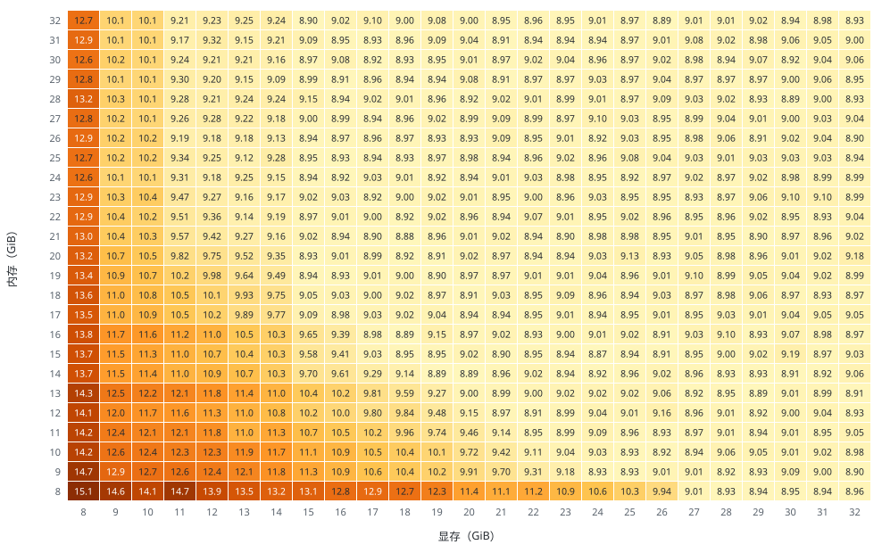
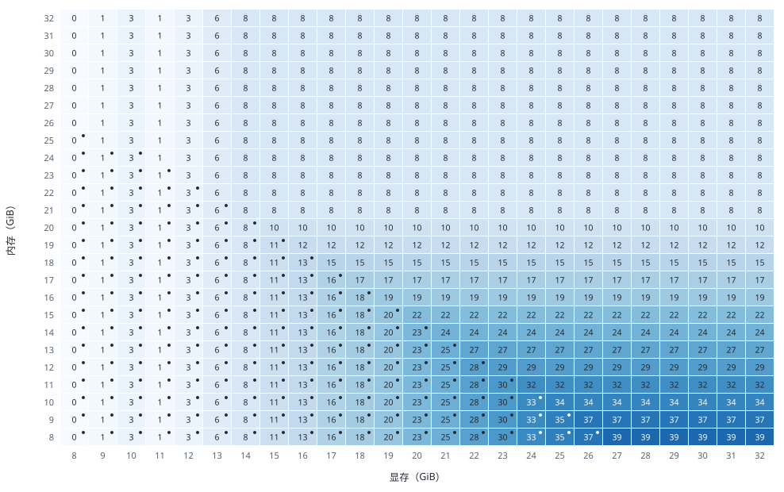

# FreeVideo Adaptive Execution Planner

FreeVideo Adaptive Execution Planner（自适应执行规划器）根据设备与主机的实时测量结果，为每个请求计算执行计划。执行计划在实测的显存与内存预算内确定：50 个 Transformer 块在显存、锁页内存与磁盘之间的驻留位置，传输调度，FP8 GEMM 路径，注意力后端与头分组，激活暂存，以及 VAE 解码器的放置。

## 输入

| 输入 | 来源 | 决定 |
| --- | --- | --- |
| 架构与计算能力 | CUDA 设备属性 | FP8 GEMM 路径与内核集 |
| 空闲显存 | `torch.cuda.mem_get_info` | 显存预算 |
| 可用内存 | 系统内存计数、cgroup v1/v2 上限、Windows 提交余量 | 内存预算 |
| 注意力后端 | 设备上的内核探测 | 后端选择 |
| 请求几何 | 宽、高、帧数换算的视频 token 数 | 激活工作集 |

显存预算：空闲显存减去预留，预留为空闲显存的 2.5%，限制在 0.5–1 GiB（Windows 为 0.25 GiB）。内存预算：可用内存减去预留，预留为可用内存的 5%，限制在 1–4 GiB（Windows 为 2–4 GiB）；Windows 页面文件不计入。

## 执行计划

| 组件 | 决策 |
| --- | --- |
| Transformer 驻留 | 常驻块数 = min(⌊(显存预算 − 激活工作集) / 432.5 MB⌋, 44)，再降到 max(8, 内存预算无法保留的块数)。非常驻块保存在内存中，锁页上限 22 GB，每一步复制到显卡。 |
| 磁盘流式读取 | 非常驻块与主机工作内存之和超过内存预算时启用：保留有界的锁页子集，其余块每一步从磁盘重新读取。 |
| 传输调度 | 显存预算不低于 14 GiB 时使用两个传输槽（预取），Windows Blackwell 与 Ampere 的门槛更低；否则使用一个传输槽。 |
| 注意力 | 按 SageAttention 2、PyTorch flash attention、cuDNN、FlashAttention 2、FlashAttention 4 的顺序选择第一个通过探测的后端。头分组：在 16、8、4 头中选择该请求 token 数下实测激活占用不超过显存预算的最宽分组。 |
| 激活暂存 | 显存预算低于 10 GiB 且设备上的激活路径放不下时，把残差流和注意力输出暂存在主机缓冲区。 |
| FP8 GEMM | Blackwell（SM120）逐张量缩放，Ada（SM89）与 Hopper（SM90）逐通道缩放，Ampere（SM80、SM86）以 FP8 存储权重、BF16 计算。 |
| 分块 | 前馈分块 2048，投影分块 1024，窗口批次 4（Ampere 为 1）。 |
| 文本编码器 | 在独立进程中运行，Transformer 加载前退出。 |
| VAE 解码器 | 显存预算低于 20 GiB 时，36 个块中 ⌊(显存预算 − 3.25 GiB) / 268.6 MB⌋ 个常驻，其余流式加载；按时间片段依次解码，分块与融合方式与原解码器相同。 |
| 二次采样 | 半分辨率的第一轮单独规划。第一轮复制到显卡的块缓存在空闲显存中：Linux 上最多到第一轮的常驻块数，Windows 上最多到实时显存预算。 |

## 运行时调整

- 每个请求前重新测量预算。
- 完成的请求把耗时和内存峰值写入 `resource-history.sqlite3`，用于请求前的预测和 `./freevideo predict`；预计另一种放置方案快 2% 以上时，替换当前方案。
- 最小工作集放不下时，请求在 Transformer 加载前被拒绝，并报告缺口。
- 内存不足的失败会在新进程中重试，最多两次（`--resource-retries`）。重试先减轻放置方案；无可再减时缩小计算分块：头分组、前馈与投影分块，再把注意力输出暂存到主机内存，浮点累加顺序可能因此改变。二次采样的第二轮失败时复用已完成的第一轮，同一台机器上的相同请求下次直接使用已成功的分块。
- `./freevideo optimize` 为本机搜索计算设置，只有完整验证运行通过后才启用。

## 查看执行计划

- `./freevideo plan --vram-gib 8 --ram-gib 16` 不加载权重即可输出指定容量下的执行计划；`--width`、`--height`、`--seconds` 指定请求。
- `<输出>.request.json` 记录测得的硬件信息、所选执行计划及每项决策的说明、各阶段耗时和内存峰值。

## 容量网格

在 NVIDIA H200 上测量 8–32 GiB 显存与 8–32 GiB 内存的每一种组合：显存用 MPS 客户端限制，内存用 cgroup 限制，不使用交换空间。请求：1344 × 768、243 帧、全分辨率单次 8 步（`--no-two-pass`）。

每个采样步的耗时（秒）：

留在显存的 Transformer 块数，圆点表示其余块每一步从磁盘读取：

## 端到端

Windows，1344 × 768、10 秒、二次采样：

| 显卡 | 显存 + 内存 | 时间 |
| --- | --- | --- |
| GeForce RTX 5090 | 32GB + 64GB | 122 秒 |
| GeForce RTX 5060 Ti | 16GB + 32GB | 486 秒 |
| GeForce RTX 4060 Ti | 16GB + 32GB | 558 秒 |
| GeForce RTX 4060 Ti | 8GB + 64GB | 603 秒 |
